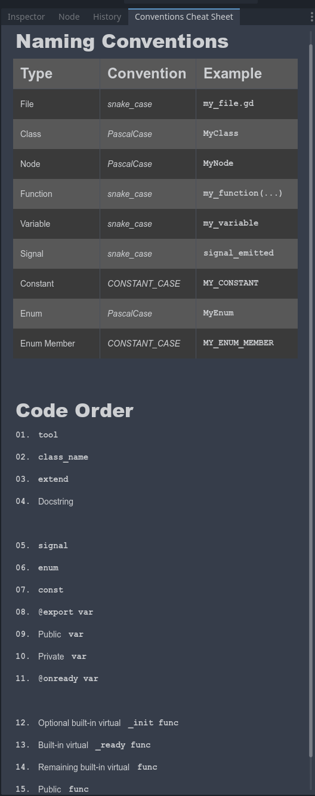

# CCS - Convention Cheat Sheet Plugin for Godot Scripts

## Overview
This Godot Engine plugin provides a useful cheat sheet containing the most important naming conventions as well as the recommended order of elements in your code.

## Features
- **A useful custom dock**: Open the dock and place it freely only constrained by the possibilities of the Godot engine itself.

## Installation
1. Clone or download this repository.
2. Copy the `addons/GodotConventionsCheatSheetPlugin` folder into the `addons` directory of your Godot project.
3. In Godot, go to `Project` -> `Project Settings` -> `Plugins`.
4. Find "Godot Conventions Cheat Sheet" in the list and click "Activate".

## Usage
Once the plugin is activated, a custom dock, named 'Conventions Cheat Sheet' should appear on the right side of your Layout.

## Compatibility
As of now, this plugin has been tested and confirmed to work on Godot 4.2.1, as this is the version I am currently using.

## Contributing
Contributions to the plugin are welcome! If you have suggestions for improvements or have found a bug, please open an issue or a pull request. Also testing on other versions has not yet been conducted. If you are using a different version of Godot and would like to contribute, please feel free to test the plugin and provide feedback on compatibility with other versions.

## License
This project is licensed under the MIT License - see the [LICENSE](LICENSE) file for details.

## Acknowledgements
- Thanks to the Godot community for their continuous support and feedback.
